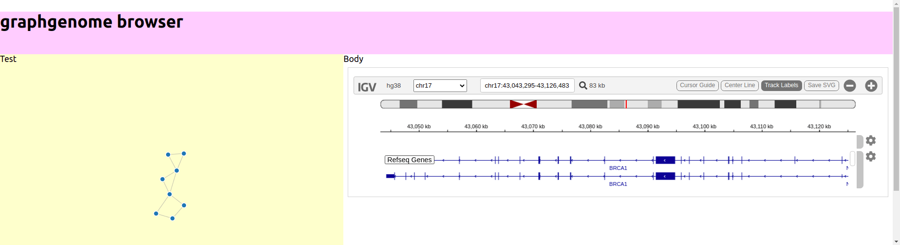

# graphgenomeviewer

This repo provides an NPM module
https://www.npmjs.com/package/graphgenomeviewer which is a react component and
a demo instance that shows some demo files in a create-react-app instance

See the lib [README](lib/README.md) for details on using the NPM module

## Demo



See https://cmdcolin.github.io/graphgenomeviewer/

## Developing locally

In one shell

```
cd lib
yarn watch
```

In another

```
cd app
yarn start
```

## Deploy lib to NPM

```
cd lib
yarn publish
```

## Deploy app to GitHub pages

```
cd app
yarn deploy
```

## File type support

This app currently supports GFA1 and a subset of GFA2. It does not fully
attempt to resolve the GFA2 edge spec with dovetails, but makes a basic attempt
to at least link the nodes specified by GFA2 edges

## Notes

Project started during BCC2020 pangenome virtual conference CoFest hackathon
team. Thanks to everyone! See [CREDITS](CREDITS.md)
